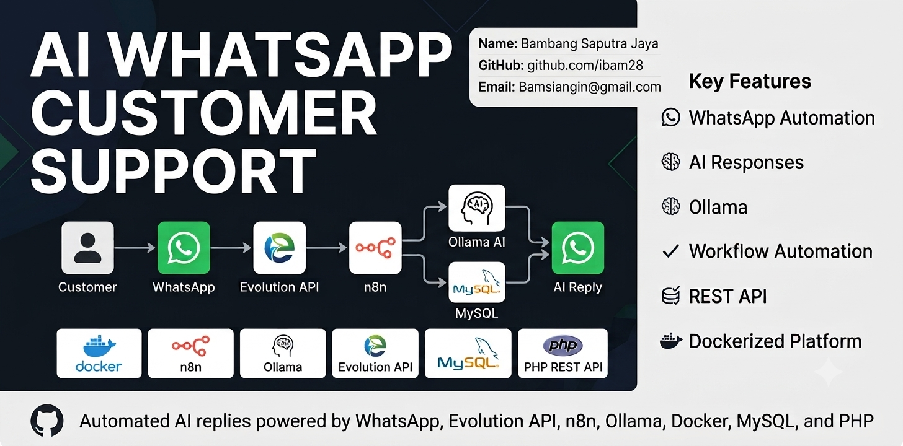
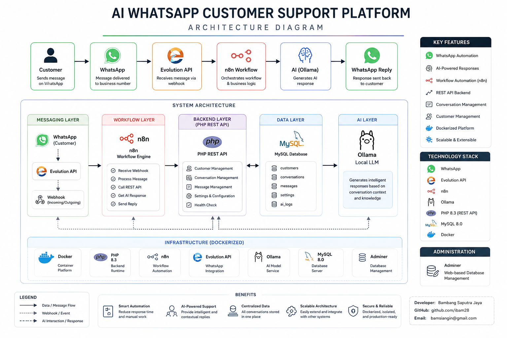

# 🤖 n8n AI WhatsApp Customer Support

> AI-powered WhatsApp Customer Support platform built with **n8n**, **Evolution API**, **Ollama**, **Docker**, **MySQL**, and **PHP REST API**.

<p align="center">
  
</p>

<p align="center">


</p>

---

# 🚀 Project Overview

This project demonstrates how to build a self-hosted AI-powered WhatsApp Customer Support platform using open-source technologies.

Incoming WhatsApp messages are intended to be received through Evolution API, processed by n8n workflows, enriched with customer and conversation data stored in MySQL, answered by Ollama AI, and automatically sent back to customers.

The project focuses on backend architecture, workflow automation, REST API development, Docker deployment, and local AI integration.

---

# ✨ Highlights

- 🤖 Self-hosted AI platform
- 💬 WhatsApp automation
- ⚡ n8n workflow automation
- 🧠 Local LLM using Ollama
- 🐘 PHP REST API
- 🗄️ MySQL database
- 🐳 Docker deployment
- 📈 Scalable architecture
- 🤝 Human handover ready
- 📚 RAG-ready architecture

---

# 🛠 Technology Stack

| Category | Technology |
|----------|------------|
| Workflow Automation | n8n |
| Messaging | Evolution API |
| AI | Ollama |
| Backend | PHP 8.3 |
| Database | MySQL 8.4 |
| Containerization | Docker |
| Administration | Adminer |

---

# 📊 Project Status

| Component | Status |
|-----------|--------|
| Documentation | ✅ Completed |
| Docker Infrastructure | ✅ Completed |
| PHP REST API | ✅ Completed |
| MySQL Database | ✅ Completed |
| Customer API | ✅ Completed |
| Evolution API Deployment | ✅ Completed |
| WhatsApp Connection | ✅ Completed |
| Webhook Validation | ✅ Completed |
| Automatic WhatsApp Events | 🚧 In Progress |
| n8n AI Workflow | ⏳ Planned |
| Ollama Integration | ⏳ Planned |

---

# ⚠️ Current Status

The infrastructure has been successfully deployed and validated.

The following components have been confirmed working:

- Docker infrastructure
- n8n server
- MySQL database
- PHP REST API
- Evolution API deployment
- WhatsApp connection
- Production webhook endpoint
- Manual webhook delivery

The automatic webhook dispatch from Evolution API to n8n is currently under investigation.

This project remains under active development.

Detailed investigation notes are available in:

```
docs/whatsapp/troubleshooting.md
```

---

# 🏗️ System Architecture

<p align="center">
  
</p>

```
WhatsApp
      │
      ▼
Evolution API
      │
      ▼
n8n
      │
      ▼
PHP REST API
      │
      ▼
MySQL
      │
      ▼
Ollama
      │
      ▼
WhatsApp Reply
```

---

# 📁 Project Structure

```text
.
├── api/
├── database/
├── docker/
├── docs/
│   ├── whatsapp/
│   │   ├── architecture.md
│   │   ├── installation.md
│   │   ├── workflow.md
│   │   ├── troubleshooting.md
│   │   └── roadmap.md
│   │
│   ├── screenshots/
│   ├── architecture-diagram.png
│   └── thumbnail.png
│
├── workflows/
├── docker-compose.yml
├── docker-compose.evolution.yml
└── README.md
```

---

# 🚀 Quick Start

## Requirements

- Docker
- Docker Compose
- Git

---

## Clone Repository

```bash
git clone git@github.com:ibam28/n8n-ai-whatsapp-customer-support.git

cd n8n-ai-whatsapp-customer-support
```

---

## Configure Environment

```bash
cp .env.example .env
cp .env.evolution.example .env.evolution
```

---

## Start REST API

```bash
docker compose up -d --build
```

---

## Start Evolution API

```bash
docker compose -f docker-compose.evolution.yml up -d
```

---

## Verify Containers

```bash
docker ps
```

Expected services

- MySQL
- Adminer
- PHP
- Evolution API
- PostgreSQL
- Redis

---

# 🌐 REST API

Current endpoints

| Method | Endpoint |
|---------|----------|
| GET | / |
| GET | /health |
| GET | /customers |

More endpoints will be added in future versions.

---

# 🗄 Database

Current tables

- customers
- conversations
- messages

Database initialization

```
database/init/

01-schema.sql
02-sample-data.sql
```

---

# 📚 Documentation

Detailed documentation

- WhatsApp Architecture
- Installation Guide
- Workflow Design
- Troubleshooting
- Development Roadmap

Located in

```
docs/whatsapp/
```

---

# 🛣️ Roadmap

## Version 1

- [x] Docker Infrastructure
- [x] REST API
- [x] Database
- [x] Customer Management
- [x] Evolution API Deployment
- [x] WhatsApp Connection
- [ ] Automatic WhatsApp Events
- [ ] n8n Workflow
- [ ] AI Integration

---

## Version 2

- [ ] Conversation Memory
- [ ] Human Handover
- [ ] CRM Integration
- [ ] Knowledge Base (RAG)
- [ ] Dashboard
- [ ] Analytics

---

# 📄 License

This project is licensed under the MIT License.

See the LICENSE file for details.