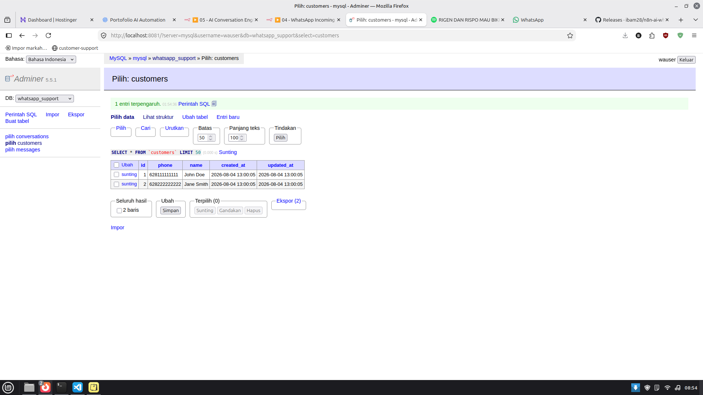
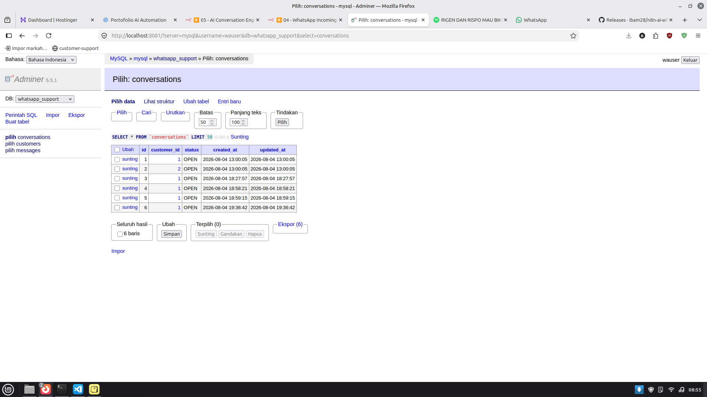
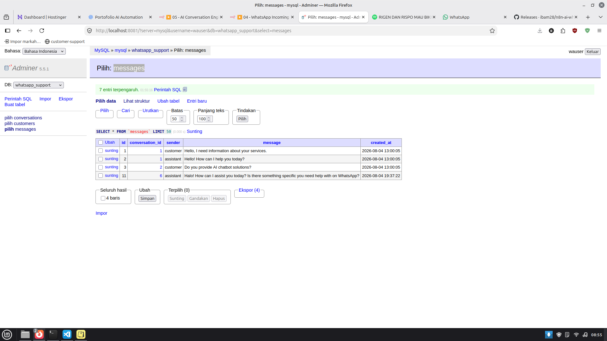
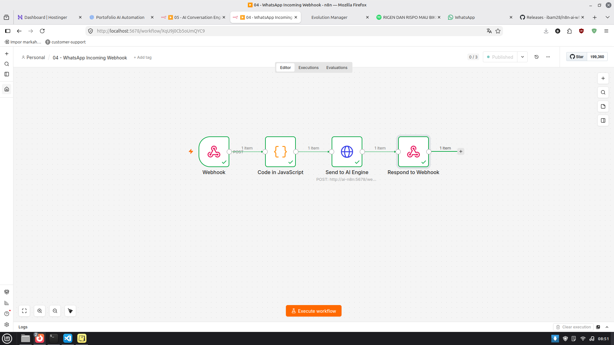
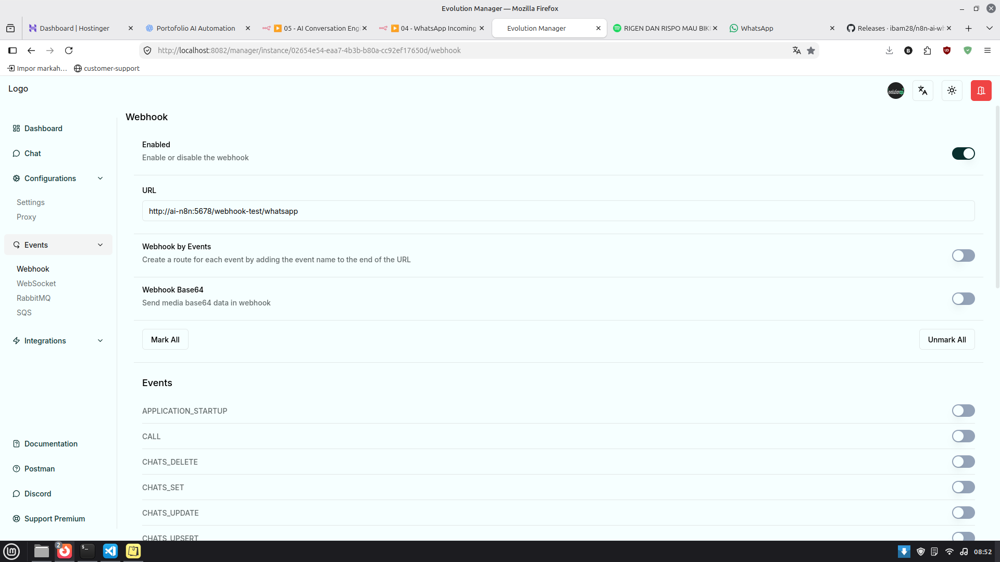
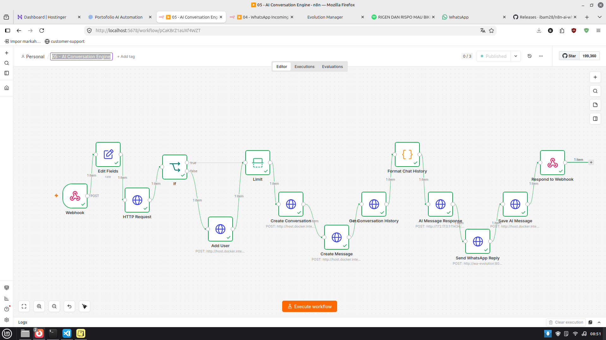
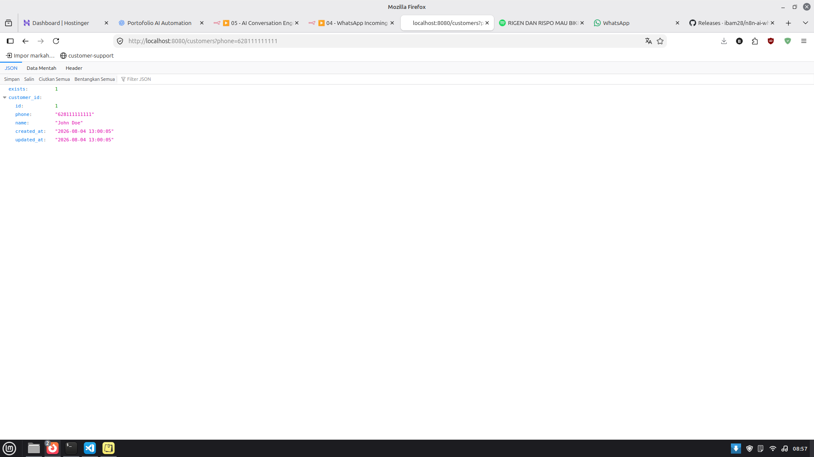

# 🤖 AI WhatsApp Customer Support Automation

An AI-powered WhatsApp customer support platform built with **Evolution API, n8n, Ollama, PHP REST API, and MySQL**.

This project automates customer conversations through WhatsApp by receiving incoming messages, processing them with AI, managing customer data, and sending intelligent responses automatically.

---

## 🚀 Features

✅ WhatsApp message integration  
✅ AI-powered automatic replies  
✅ Local LLM using Ollama  
✅ Workflow automation using n8n  
✅ Customer management REST API  
✅ MySQL database storage  
✅ Docker-based deployment  
✅ Conversation and message tracking  

---

# 🏗️ System Architecture


```
Customer WhatsApp
        |
        v
Evolution API
        |
        v
n8n Webhook
        |
        |
        +----------------+
        |                |
        v                v
Customer API        Ollama AI
(PHP REST API)      (LLM Engine)
        |                |
        v                |
     MySQL <-------------+
        |
        v
Send AI Response
        |
        v
Customer WhatsApp
```

---

# 🔄 Workflow


### 1. Customer sends WhatsApp message

Example:

```
Customer:
"Hello, I need help"
```

↓

### 2. Evolution API receives message

Evolution API captures WhatsApp events:

```
messages.upsert
```

↓

### 3. n8n processes webhook

n8n receives:

```json
{
  "from": "6281371665540",
  "message": "Hello"
}
```

↓

### 4. Customer verification

The system checks customer data:

```
GET /customers?phone=6281371665540
```

If customer does not exist:

```
POST /customers
```

Create new customer.

↓

### 5. AI Processing

Message is sent to Ollama:

```
User Message
      |
      v
 Ollama LLM
      |
      v
 AI Response
```

↓

### 6. Send response back to WhatsApp

Customer receives AI answer automatically.

---

# 🧠 AI Engine

This project uses **Ollama** as a local AI engine.

Benefits:

- No external AI API dependency
- Runs locally
- Full control of models
- Private customer conversations


Example flow:

```
n8n
 |
 v
Ollama API
 |
 v
Generated Response
 |
 v
WhatsApp
```

---

# 🛠️ Tech Stack


## Backend

- PHP 8+
- REST API
- MySQL
- PDO Database Layer


## Automation

- n8n Workflow Automation


## AI

- Ollama Local LLM


## WhatsApp

- Evolution API


## Infrastructure

- Docker
- Docker Compose


---

# 📂 Project Structure


```
n8n-ai-whatsapp-customer-support/

│
├── api/
│   ├── controllers/
│   ├── services/
│   ├── models/
│   └── routes/
│
├── n8n/
│   └── workflows/
│
├── database/
│
├── docs/
│   └── screenshots/
│
├── docker-compose.yml
│
└── README.md

```

---

# 🗄️ Database Design


## Customers

Stores customer information.

Example:

```json
{
  "name": "John Doe",
  "phone": "628111111111"
}
```


Screenshot:




---

## Conversations

Stores customer conversation sessions.





---

## Messages

Stores incoming and outgoing messages.





---

# 🔌 REST API


## Health Check

```
GET /health
```


Response:

```json
{
 "status":"ok"
}
```


---

## Get Customer


```
GET /customers?phone=6281371665540
```


Response:

```json
{
 "exists":1,
 "name":"BAMBANG",
 "phone":"6281371665540"
}
```


---

## Create Customer


```
POST /customers
```


Request:

```json
{
 "name":"BAMBANG",
 "phone":"6281371665540"
}
```


Response:

```json
{
 "status":"success",
 "message":"Customer created"
}
```


---

# 🐳 Docker Services


Containers used:


| Service | Description |
|-|-|
| ai-n8n | Workflow automation |
| wa-evolution | WhatsApp gateway |
| wa-mysql | Customer database |
| wa-php | REST API |
| wa-redis | Cache service |
| wa-postgres | Evolution database |


---

# 📸 Screenshots


## n8n Workflow




## Evolution API Management




## AI Conversation Engine Workflow




## API Response Example



---

# ⚙️ Installation


## 1. Clone Repository


```bash
git clone https://github.com/ibam28/n8n-ai-whatsapp-customer-support.git

cd n8n-ai-whatsapp-customer-support
```


---

## 2. Start Docker


```bash
docker compose up -d
```


---

## 3. Check Containers


```bash
docker ps
```


---

## 4. Access Services


n8n:

```
http://localhost:5678
```


Evolution API:

```
http://localhost:8082
```


REST API:

```
http://localhost:8080
```


---

# 🔐 Environment Configuration


Example:

```
MYSQL_HOST=wa-mysql
MYSQL_DATABASE=customer_support
MYSQL_USER=root
MYSQL_PASSWORD=password
```

---

# 🎯 Project Goals


This project demonstrates practical implementation of:


- AI customer support automation
- WhatsApp chatbot development
- REST API development
- Database integration
- Workflow automation
- Local AI deployment
- Docker containerization


---

# 👨‍💻 Author


**Bambang**

GitHub:

https://github.com/ibam28


---

# ⭐ Future Improvements


- Conversation memory
- Customer dashboard
- Admin panel
- AI knowledge base (RAG)
- Multi-agent support
- Analytics dashboard
